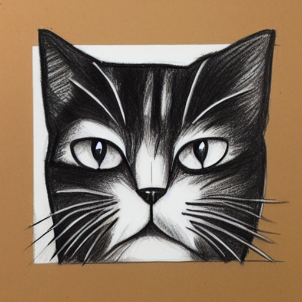
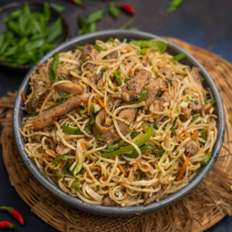
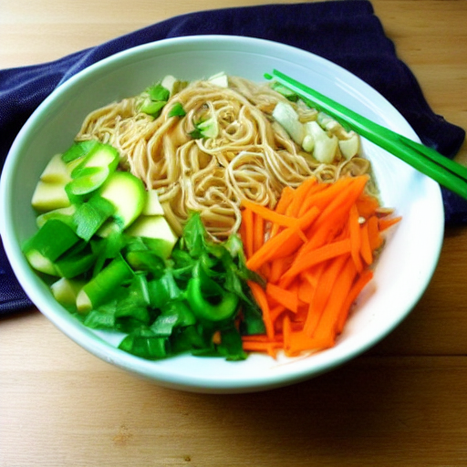
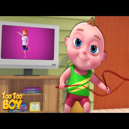
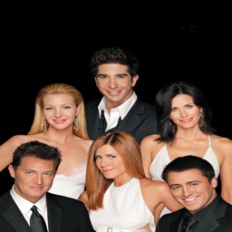
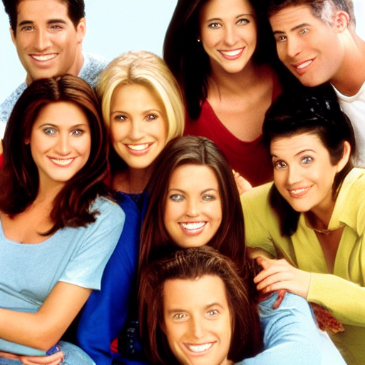

<h1 align="center">Fast-Processing Bi-Modal Large Language and Vision Model</h1>

<strong>Author:</strong> Rugved Chavan

## Overview
This repository explores the intersection of different AI modalities, particularly focusing on text and image generation. Our research delves into the intricacies of generative AI, leveraging advanced algorithms and data availability to push the boundaries of what's possible in AI-driven content creation.

<a href="https://drive.google.com/file/d/1bbTWNTyIbkP4g7fbxLu7H_tqGDJNQEmE/view?usp=sharing" style="background-color: #4CAF50; color: white; padding: 10px 20px; text-align: center; text-decoration: none; display: inline-block; font-size: 16px; margin: 4px 2px; cursor: pointer; border-radius: 12px;">Download the Report</a> | <a href="https://www.youtube.com/watch?v=bDb0FkX1tLI" style="background-color: #FF0000; color: white; padding: 10px 20px; text-align: center; text-decoration: none; display: inline-block; font-size: 16px; margin: 4px 2px; cursor: pointer; border-radius: 12px;">YouTube Video</a>

Download the `model.h5` file from Google Drive: [Download Model](https://drive.google.com/file/d/1u53HryRB4cXAt3rtpu0zx1tJvkAmGHXm/view?usp=sharing)

  

## Abstract
Recently, Generative AI has gained popularity due to an increase in data availability, advanced algorithms, and the wider accessibility of generative AI tools. Sophisticated algorithms, such as attention mechanisms like Transformers for text generation and UNet for diffusion models in image generation, as well as audio channels with a single channel mel-spectrogram, are contributing factors. Additionally, pseudo-temporal attention mechanisms are utilized for video generation. There has been substantial research in each modality—image, video, audio, text—aiming to emulate human-like understanding, reasoning skills, and creativity. Concurrently, there is parallel research focused on creating multi-modality models capable of generating paired content across various formats.We will develop a Bi-modality model [Text, Image] to demonstrate our hypothesis of enhanced performance based on a pretrained model, rather than starting from scratch. Utilizing core technologies such as CLIP, GPT-3.5 LLM, Stable Diffusion UNet, and Diffusion VAE Decoders, this model will eliminate the requirement to specify which output modality needs to be activated.

## Video Overview

  

  <em>Click on the image above to watch the video.</em>

## Sample Responses

#### Task: Text to Image
**Prompt:** Generate an Image of a Cat.

  

#### Task: Text + Image to Text
**Prompt:** Describe the dish in the provided image, including potential ingredients and flavors.

  

**Output:**  
This bowl of noodles is a delicious and comforting dish, likely made with noodles such as ramen, udon, spaghetti, or risoni. The savory broth is a combination of vegetables, meats (possibly pork, chicken, beef, or tofu), and flavorful seasonings like garlic, ginger, and soy sauce. Ingredients are cooked together in a rich broth with vegetables like carrots, onion, bell pepper, and mushrooms, adding substantial nutritional value.

#### Task: Text + Image to Text + Image
**Prompt:** How can I make the noodles healthy? Explain with both image and text.

  

**Output:**  
To make your noodles healthier, opt for whole grain, buckwheat, or soba noodles instead of processed ones. Include lean proteins like grilled chicken, tofu, or shrimp. Add a variety of vegetables such as bok choy, kale, snap peas, edamame, and mushrooms. Flavor with fresh herbs and use low sodium broth and seasonings.

#### Task: Text + Image to Text
**Prompt:** How can I make the noodles healthy? Explain with both image and text.

  

**Output:**  
The child in the image is holding a rope, possibly pretending to swing on it. The rope is likely a toy made from soft, flexible material. Depending on the child's age, it could also be part of a larger toy like a swing or a jump rope.

#### Task: Image to Text + Image

  

**Prompt:** How can I make the noodles healthy? Explain with both image and text.

  

**Output:**  
The cast of 'Friends' is a popular American TV sitcom featuring six main characters: Ross Geller, Rachel Green, Chandler Bing, Monica Geller, Joey Tribbiani, and Phoebe Buffay. Set in Manhattan, the show follows their life experiences, emphasizing each character's unique personality and humorous misadventures.

## References
1. Transformers for Text Generation
2. UNet for Stable Diffusion Model
3. DL classifiers for output decisions. 
