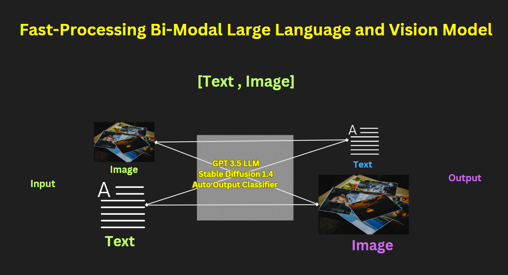

<h1 align="center">Fast-Processing Bi-Modal Large Language and Vision Model</h1>

<strong>Author:</strong> Rugved Chavan

## Overview
This repository explores the intersection of different AI modalities, particularly focusing on text and image generation. Our research delves into the intricacies of generative AI, leveraging advanced algorithms and data availability to push the boundaries of what's possible in AI-driven content creation.

<a href="https://drive.google.com/file/d/1bbTWNTyIbkP4g7fbxLu7H_tqGDJNQEmE/view?usp=sharing" style="background-color: #4CAF50; color: white; padding: 10px 20px; text-align: center; text-decoration: none; display: inline-block; font-size: 16px; margin: 4px 2px; cursor: pointer; border-radius: 12px;">Download the Report</a> | <a href="https://www.youtube.com/watch?v=bDb0FkX1tLI" style="background-color: #FF0000; color: white; padding: 10px 20px; text-align: center; text-decoration: none; display: inline-block; font-size: 16px; margin: 4px 2px; cursor: pointer; border-radius: 12px;">YouTube Video</a>

Download the `model.h5` file from Google Drive: [Download Model](https://drive.google.com/file/d/1u53HryRB4cXAt3rtpu0zx1tJvkAmGHXm/view?usp=sharing)

  

## Abstract
Recently, Generative AI has gained popularity due to an increase in data availability, advanced algorithms, and the wider accessibility of generative AI tools. Sophisticated algorithms, such as attention mechanisms like Transformers for text generation and UNet for diffusion models in image generation, as well as audio channels with a single channel mel-spectrogram, are contributing factors. Additionally, pseudo-temporal attention mechanisms are utilized for video generation. There has been substantial research in each modality—image, video, audio, text—aiming to emulate human-like understanding, reasoning skills, and creativity. Concurrently, there is parallel research focused on creating multi-modality models capable of generating paired content across various formats.We will develop a Bi-modality model [Text, Image] to demonstrate our hypothesis of enhanced performance based on a pretrained model, rather than starting from scratch. Utilizing core technologies such as CLIP, GPT-3.5 LLM, Stable Diffusion UNet, and Diffusion VAE Decoders, this model will eliminate the requirement to specify which output modality needs to be activated.

## Video Overview

  

  <em>Click on the image above to watch the video.</em>

## References
1. Transformers for Text Generation
2. UNet for Stable Diffusion Model
3. DL classifiers for output decisions. 
